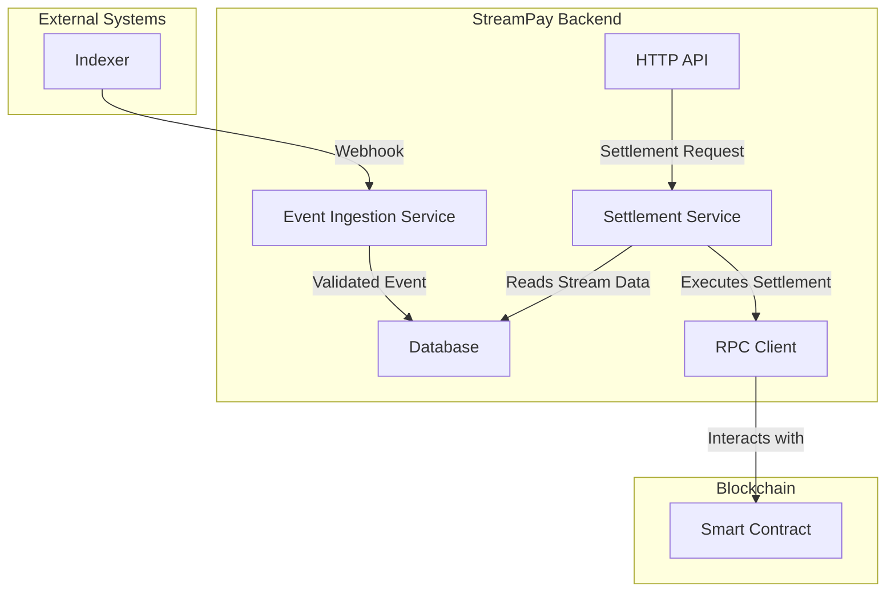

# StreamPay Backend Architecture

This document provides an overview of the StreamPay backend architecture, its components, and the data flow for key operations.

## Components

The backend is composed of the following main components:

- **HTTP API:** A public-facing API for managing streams, metering, and settlements.
- **Workers:** Background services for handling asynchronous tasks like event ingestion and processing.
- **Database:** A PostgreSQL database for storing stream data, account information, and other persistent data.
- **Redis:** An in-memory data store for caching and managing distributed locks.
- **RPC Clients:** Clients for interacting with blockchain nodes for on-chain operations.

## Data Flow

### Stream Settlement

The following diagram illustrates the data flow for stream settlement:

**Steps:**

1. The **Indexer** sends a webhook to the **Event Ingestion Service** when a stream is created or updated.
2. The **Event Ingestion Service** validates the webhook and stores the event data in the **Database**.
3. A user initiates a settlement through the **HTTP API**.
4. The **Settlement Service** reads the stream data from the **Database**.
5. The **Settlement Service** uses the **RPC Client** to execute the settlement on the blockchain.
6. The **RPC Client** interacts with the **Smart Contract** to perform the settlement.
